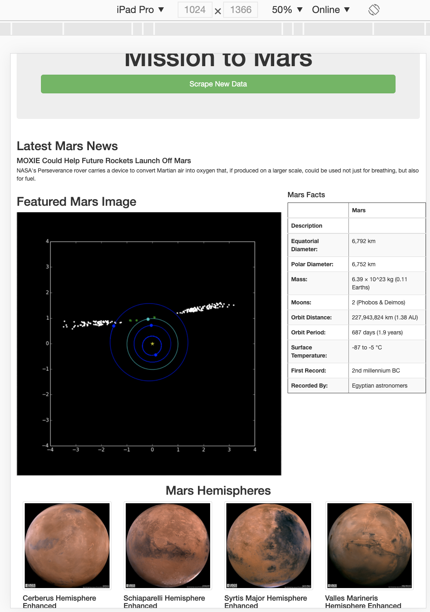

# Mission to Mars
This is a webscraping project on Mars data; retrieving latest news, featured images, facts and images of Mar's hemispheres from various sites.  Data is scraped and compiled in one custom website for presentation.  The custom website is responsive to different display platforms (ie., smartphones, tablets,laptops, etc.).  Additional bootstrap stylesheet is used to stylize the scrape data button and format Mars hemisphere images as thumbnails.

Responsive mode for iPadPro:
